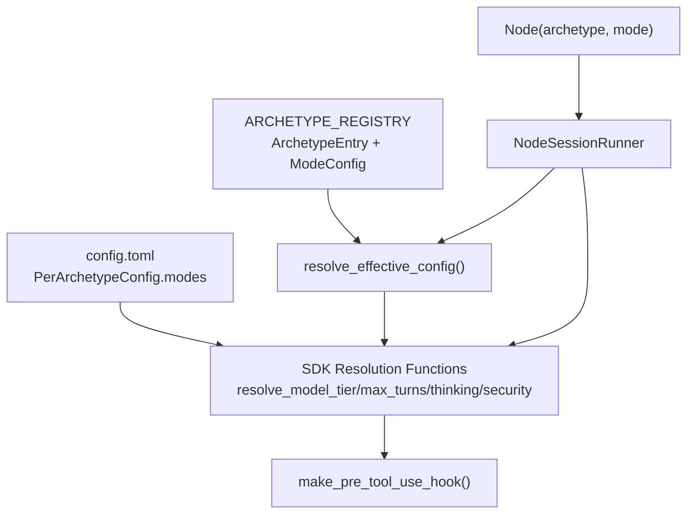

# Design Document: Archetype Model v3 — Mode Infrastructure

## Overview

This spec extends the archetype system with **mode support** — a mechanism for
archetypes to have named variants with distinct configurations. Each mode can
override templates, allowlist, model tier, injection timing, thinking settings,
and max turns while inheriting everything else from the base archetype.

The implementation modifies five modules: `archetypes.py` (data model),
`graph/types.py` (Node), `core/config.py` (configuration schema),
`engine/sdk_params.py` (resolution functions), and `hooks/security.py`
(allowlist enforcement). The `engine/session_lifecycle.py` module is updated to
thread the mode parameter through session setup.

## Architecture



### Module Responsibilities

1. **`agent_fox/archetypes.py`** — Defines `ModeConfig`, extends
   `ArchetypeEntry` with `modes` dict, provides `resolve_effective_config()`.
2. **`agent_fox/graph/types.py`** — Adds `mode: str | None` to `Node`.
3. **`agent_fox/core/config.py`** — Extends `PerArchetypeConfig` with nested
   `modes` dict for per-mode TOML overrides.
4. **`agent_fox/engine/sdk_params.py`** — Adds `mode` parameter to all
   `resolve_*` functions with 4-tier priority resolution.
5. **`agent_fox/hooks/security.py`** — Passes mode through allowlist
   resolution; empty allowlist blocks all Bash.
6. **`agent_fox/engine/session_lifecycle.py`** — Threads `mode` from `Node`
   through to SDK resolution and security hook creation.

## Execution Paths

### Path 1: Archetype resolution with mode

```
1. engine/session_lifecycle.py: NodeSessionRunner.__init__(archetype="reviewer", mode="pre-review")
2. engine/sdk_params.py: resolve_model_tier(config, "reviewer", mode="pre-review") → str
3. engine/sdk_params.py: _resolve_with_mode(config, "reviewer", "pre-review", "model_tier") → str | None
4. archetypes.py: get_archetype("reviewer") → ArchetypeEntry
5. archetypes.py: resolve_effective_config(entry, "pre-review") → ArchetypeEntry
   — merges ModeConfig overrides onto base, returns new ArchetypeEntry
```

### Path 2: Security hook creation with mode

```
1. engine/session_lifecycle.py: NodeSessionRunner.__init__(archetype="reviewer", mode="pre-review")
2. engine/sdk_params.py: resolve_security_config(config, "reviewer", mode="pre-review") → SecurityConfig | None
3. hooks/security.py: make_pre_tool_use_hook(security_config) → Callable
4. hooks/security.py: build_effective_allowlist(security_config) → frozenset[str]
   — empty frozenset for pre-review (no shell)
5. hooks/security.py: hook() blocks all Bash tool invocations
```

### Path 3: Config resolution with mode

```
1. engine/sdk_params.py: resolve_max_turns(config, "reviewer", mode="pre-review") → int | None
2. config reads: config.archetypes.overrides["reviewer"].modes["pre-review"].max_turns → None (not set)
3. config reads: config.archetypes.overrides["reviewer"].max_turns → None (not set)
4. archetypes.py: resolve_effective_config(get_archetype("reviewer"), "pre-review") → ArchetypeEntry
5. returns: effective_entry.default_max_turns
```

### Path 4: Graph node with mode

```
1. graph/injection.py: creates Node(archetype="reviewer", mode="pre-review", ...)
2. graph serialization: includes mode field in JSON output
3. graph deserialization: restores mode field from JSON input
4. engine reads: node.archetype → "reviewer", node.mode → "pre-review"
5. engine/session_lifecycle.py: NodeSessionRunner(archetype=node.archetype, mode=node.mode)
```

## Components and Interfaces

### Data Types

```python
# agent_fox/archetypes.py

@dataclass(frozen=True)
class ModeConfig:
    """Mode-specific overrides for an archetype entry.

    Every field defaults to None, meaning 'inherit from base'.
    An empty list for allowlist means 'no shell access'.
    """
    templates: list[str] | None = None
    injection: str | None = None
    allowlist: list[str] | None = None
    model_tier: str | None = None
    max_turns: int | None = None
    thinking_mode: str | None = None
    thinking_budget: int | None = None
    retry_predecessor: bool | None = None


@dataclass(frozen=True)
class ArchetypeEntry:
    """Configuration bundle for a single archetype."""
    name: str
    templates: list[str] = field(default_factory=list)
    default_model_tier: str = "STANDARD"
    injection: str | None = None
    task_assignable: bool = True
    retry_predecessor: bool = False
    default_allowlist: list[str] | None = None
    default_max_turns: int = 200
    default_thinking_mode: str = "disabled"
    default_thinking_budget: int = 10000
    modes: dict[str, ModeConfig] = field(default_factory=dict)  # NEW


def resolve_effective_config(
    entry: ArchetypeEntry,
    mode: str | None = None,
) -> ArchetypeEntry:
    """Merge mode overrides onto base entry, returning a resolved entry."""
    ...


def get_archetype(name: str) -> ArchetypeEntry:
    """Look up an archetype by name, falling back to 'coder'."""
    ...
```

```python
# agent_fox/graph/types.py

@dataclass
class Node:
    id: str
    spec_name: str
    group_number: int
    title: str
    optional: bool
    status: NodeStatus = NodeStatus.PENDING
    subtask_count: int = 0
    body: str = ""
    archetype: str = "coder"
    mode: str | None = None  # NEW — 97-REQ-2.1
    instances: int = 1
```

```python
# agent_fox/core/config.py

class PerArchetypeConfig(BaseModel):
    model_tier: str | None = None
    max_turns: int | None = None
    thinking_mode: Literal["enabled", "adaptive", "disabled"] | None = None
    thinking_budget: int | None = None
    allowlist: list[str] | None = None
    modes: dict[str, "PerArchetypeConfig"] = Field(default_factory=dict)  # NEW
```

### SDK Resolution Functions

All four resolve functions gain an optional `mode` parameter:

```python
# agent_fox/engine/sdk_params.py

def resolve_model_tier(config: AgentFoxConfig, archetype: str, *, mode: str | None = None) -> str: ...
def resolve_max_turns(config: AgentFoxConfig, archetype: str, *, mode: str | None = None) -> int | None: ...
def resolve_thinking(config: AgentFoxConfig, archetype: str, *, mode: str | None = None) -> dict | None: ...
def resolve_security_config(config: AgentFoxConfig, archetype: str, *, mode: str | None = None) -> SecurityConfig | None: ...
```

Each follows the same 4-tier resolution priority:

1. `config.archetypes.overrides[archetype].modes[mode].<field>` (if mode and
   mode config exist)
2. `config.archetypes.overrides[archetype].<field>` (archetype-level override)
3. Registry `ModeConfig` for the mode (via `resolve_effective_config`)
4. Registry `ArchetypeEntry` base default

### Session Lifecycle

```python
# agent_fox/engine/session_lifecycle.py

class NodeSessionRunner:
    def __init__(
        self,
        node_id: str,
        config: AgentFoxConfig,
        *,
        archetype: str = "coder",
        mode: str | None = None,  # NEW
        instances: int = 1,
        ...
    ) -> None:
        self._mode = mode
        # Resolution calls now include mode:
        self._resolved_model_id = resolve_model(
            resolve_model_tier(self._config, self._archetype, mode=self._mode)
        ).model_id
        self._resolved_security = resolve_security_config(
            self._config, self._archetype, mode=self._mode
        )
```

## Data Models

### TOML Configuration Schema

```toml
[archetypes.overrides.reviewer]
model_tier = "STANDARD"
max_turns = 80

[archetypes.overrides.reviewer.modes.pre-review]
# No shell access for pre-review mode
allowlist = []
max_turns = 60

[archetypes.overrides.reviewer.modes.drift-review]
allowlist = ["ls", "cat", "git", "grep", "find", "head", "tail", "wc"]
```

### Graph JSON Schema (Node)

```json
{
  "id": "spec_name:0",
  "spec_name": "spec_name",
  "group_number": 0,
  "title": "Pre-review",
  "optional": false,
  "status": "pending",
  "archetype": "reviewer",
  "mode": "pre-review",
  "instances": 1
}
```

## Operational Readiness

- **Observability:** All resolution functions log at DEBUG level when mode
  overrides are applied. Warnings logged for unknown modes (97-REQ-1.E1).
- **Rollout:** This is a non-behavioral change — the existing registry has no
  modes defined, so all current code paths hit `mode=None` and behave
  identically to before.
- **Migration:** No data migration needed. The mode field on Node defaults to
  `None`, so existing serialized graphs remain valid.

## Correctness Properties

### Property 1: Mode Override Semantics

*For any* `ArchetypeEntry` with a `modes` dict containing mode `m`, and for
any field `f` in `ModeConfig` where `modes[m].f` is not `None`,
`resolve_effective_config(entry, m).f` SHALL equal `modes[m].f`.

**Validates: Requirements 97-REQ-1.3, 97-REQ-1.5**

### Property 2: Mode Inheritance Semantics

*For any* `ArchetypeEntry` with a `modes` dict containing mode `m`, and for
any field `f` in `ModeConfig` where `modes[m].f` is `None`,
`resolve_effective_config(entry, m).f` SHALL equal the base entry's
corresponding field value.

**Validates: Requirements 97-REQ-1.5**

### Property 3: Null Mode Identity

*For any* `ArchetypeEntry` `e`, `resolve_effective_config(e, None)` SHALL
return a value equal to `e` (modulo the `modes` field being cleared on the
result).

**Validates: Requirements 97-REQ-1.4, 97-REQ-4.E1**

### Property 4: Resolution Priority Chain

*For any* archetype `a` with mode `m`, and for any parameter field `f`, the
resolved value SHALL be the first non-`None` value in the chain:
  1. `config.overrides[a].modes[m].f`
  2. `config.overrides[a].f`
  3. `registry.entries[a].modes[m].f`
  4. `registry.entries[a].base.f`

**Validates: Requirements 97-REQ-3.3, 97-REQ-4.1, 97-REQ-4.2, 97-REQ-4.3,
97-REQ-4.4**

### Property 5: Empty Allowlist Blocks All Bash

*For any* resolved configuration where the effective allowlist is an empty
list `[]`, the security hook SHALL block every Bash tool invocation.

**Validates: Requirements 97-REQ-5.2**

### Property 6: Serialization Round-Trip

*For any* `Node` with `mode=m` (where `m` may be `None` or a string),
serializing the node to JSON and deserializing it back SHALL produce a `Node`
with `mode` equal to `m`.

**Validates: Requirements 97-REQ-2.2**

## Error Handling

| Error Condition | Behavior | Requirement |
|----------------|----------|-------------|
| Unknown mode name passed to `resolve_effective_config()` | Log warning, return base entry | 97-REQ-1.E1 |
| Empty `modes` dict with mode argument | Return base entry (no warning) | 97-REQ-1.E2 |
| `mode=None` passed to any resolution function | Modeless resolution (current behavior) | 97-REQ-4.E1 |
| Mode allowlist is `None` (inherit) | Use base archetype allowlist | 97-REQ-5.E1 |
| Mode allowlist is `[]` (empty) | Block all Bash commands | 97-REQ-5.2 |

## Technology Stack

- Python 3.12+
- `dataclasses` (frozen dataclass for `ModeConfig`, `ArchetypeEntry`)
- `pydantic` v2 (for `PerArchetypeConfig` extension)
- Existing test stack: `pytest`, `hypothesis`

## Definition of Done

A task group is complete when ALL of the following are true:

1. All subtasks within the group are checked off (`[x]`)
2. All spec tests (`test_spec.md` entries) for the task group pass
3. All property tests for the task group pass
4. All previously passing tests still pass (no regressions)
5. No linter warnings or errors introduced
6. Code is committed on a feature branch and merged into `develop`
7. `tasks.md` checkboxes are updated to reflect completion

## Testing Strategy

- **Unit tests** verify `ModeConfig` field defaults, `resolve_effective_config`
  merge logic, config parsing, and SDK resolution function signatures.
- **Property-based tests** (Hypothesis) verify override/inheritance semantics,
  resolution priority chain, serialization round-trip, and empty-allowlist
  blocking across randomly generated configurations.
- **Integration smoke tests** verify end-to-end mode resolution from Node
  through session setup.
