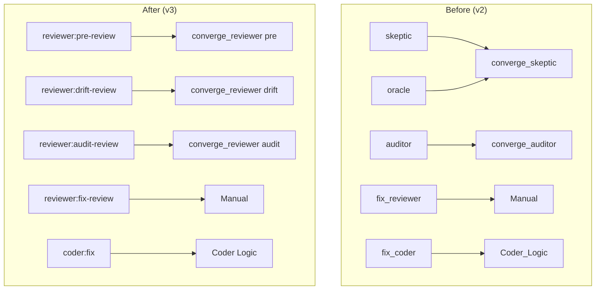

# Design Document: Reviewer Consolidation

## Overview

This spec consolidates the separate review archetypes (skeptic, oracle,
auditor, fix_reviewer) into a single `reviewer` archetype with 4 named modes.
It also folds `fix_coder` into `coder` as mode `fix`, updates the verifier to
single-instance STANDARD tier, and cleans up the registry and configuration.

The implementation modifies the archetype registry, injection logic,
convergence dispatch, prompt templates, and configuration schema — all built
on the mode infrastructure from Spec 97.

## Architecture



### Module Responsibilities

1. **`agent_fox/archetypes.py`** — Updated `ARCHETYPE_REGISTRY` with
   consolidated entries. Removes 5 old entries, adds modes to reviewer and
   coder.
2. **`agent_fox/graph/injection.py`** — Updated injection functions to create
   reviewer-mode nodes. Updated `ArchetypeEntry` tuple to carry mode.
3. **`agent_fox/session/convergence.py`** — New `converge_reviewer()` dispatch
   function that routes to existing algorithms by mode.
4. **`agent_fox/_templates/prompts/reviewer.md`** — Merged review template.
5. **`agent_fox/core/config.py`** — Updated `ArchetypesConfig`,
   `ArchetypeInstancesConfig`, new `ReviewerConfig`.
6. **`agent_fox/engine/session_lifecycle.py`** — Passes mode to convergence.
7. **`agent_fox/engine/result_handler.py`** — Routes convergence by mode.

## Execution Paths

### Path 1: Pre-review injection and execution

```
1. graph/injection.py: collect_enabled_auto_pre(config) → list[ArchetypeEntry] with ("reviewer", "pre-review")
2. graph/injection.py: ensure_graph_archetypes() creates Node(archetype="reviewer", mode="pre-review")
3. engine/session_lifecycle.py: NodeSessionRunner(archetype="reviewer", mode="pre-review")
4. engine/sdk_params.py: resolve_model_tier(config, "reviewer", mode="pre-review") → "STANDARD"
5. engine/sdk_params.py: resolve_security_config(config, "reviewer", mode="pre-review") → SecurityConfig(bash_allowlist=[])
6. session/prompt.py: build_system_prompt(archetype="reviewer", mode="pre-review") → loads reviewer.md with pre-review section
7. engine/result_handler.py: converge_reviewer(results, mode="pre-review") → calls converge_skeptic()
```

### Path 2: Drift-review with oracle gating

```
1. graph/injection.py: collect_enabled_auto_pre(config, spec_path) → checks drift-review gating
2. graph/spec_helpers.py: spec_has_existing_code(spec_path) → bool
3. IF False: drift-review excluded from returned list
4. IF True: Node(archetype="reviewer", mode="drift-review") created
5. engine/session_lifecycle.py: executes with analysis allowlist
6. engine/result_handler.py: converge_reviewer(results, mode="drift-review") → calls converge_skeptic()
```

### Path 3: Audit-review injection and convergence

```
1. graph/injection.py: resolve_auditor_config(config) → ReviewerAuditConfig(enabled, min_ts, instances)
2. graph/injection.py: ensure_graph_archetypes() injects Node(archetype="reviewer", mode="audit-review") after test-writing groups
3. engine/session_lifecycle.py: NodeSessionRunner(archetype="reviewer", mode="audit-review")
4. engine/result_handler.py: converge_reviewer(results, mode="audit-review") → calls converge_auditor()
```

### Path 4: Coder fix mode

```
1. nightshift/engine.py: creates NodeSessionRunner(archetype="coder", mode="fix")
2. engine/sdk_params.py: resolve_model_tier(config, "coder", mode="fix") → "STANDARD"
3. session/prompt.py: build_system_prompt(archetype="coder", mode="fix") → loads fix_coding.md
4. Session executes with full coder permissions
```

## Components and Interfaces

### Updated Registry

```python
# agent_fox/archetypes.py

ARCHETYPE_REGISTRY = {
    "coder": ArchetypeEntry(
        name="coder",
        templates=["coding.md"],
        default_model_tier="STANDARD",
        injection=None,
        task_assignable=True,
        default_max_turns=300,
        default_thinking_mode="adaptive",
        default_thinking_budget=64000,
        modes={
            "fix": ModeConfig(
                templates=["fix_coding.md"],
                max_turns=300,
                thinking_mode="adaptive",
                thinking_budget=64000,
            ),
        },
    ),
    "reviewer": ArchetypeEntry(
        name="reviewer",
        templates=["reviewer.md"],
        default_model_tier="STANDARD",
        injection=None,  # mode-specific
        task_assignable=True,
        default_max_turns=80,
        modes={
            "pre-review": ModeConfig(
                injection="auto_pre",
                allowlist=[],  # no shell
            ),
            "drift-review": ModeConfig(
                injection="auto_pre",
                allowlist=["ls", "cat", "git", "grep", "find", "head", "tail", "wc"],
            ),
            "audit-review": ModeConfig(
                injection="auto_mid",
                allowlist=["ls", "cat", "git", "grep", "find", "head", "tail", "wc", "uv"],
                retry_predecessor=True,
            ),
            "fix-review": ModeConfig(
                model_tier="ADVANCED",
                allowlist=["ls", "cat", "git", "grep", "find", "head", "tail", "wc", "uv", "make"],
                max_turns=120,
            ),
        },
    ),
    "verifier": ArchetypeEntry(
        name="verifier",
        templates=["verifier.md"],
        default_model_tier="STANDARD",  # Changed from ADVANCED
        injection="auto_post",
        task_assignable=True,
        retry_predecessor=True,
        default_max_turns=120,
    ),
    "triage": ArchetypeEntry(
        name="triage",
        templates=["triage.md"],
        default_model_tier="ADVANCED",
        injection=None,
        task_assignable=False,
        default_allowlist=["ls", "cat", "git", "wc", "head", "tail"],
        default_max_turns=80,
    ),
}
```

### Convergence Dispatch

```python
# agent_fox/session/convergence.py

def converge_reviewer(
    results: list[Any],
    mode: str,
    *,
    block_threshold: int = 3,
    min_ts_entries: int = 5,
) -> Any:
    """Dispatch convergence by reviewer mode.

    - pre-review, drift-review → converge_skeptic (majority-gated blocking)
    - audit-review → converge_auditor (union/worst-verdict-wins)
    - fix-review → single instance, no convergence needed
    """
    if mode in ("pre-review", "drift-review"):
        return converge_skeptic(results, block_threshold=block_threshold)
    elif mode == "audit-review":
        return converge_auditor(results)
    elif mode == "fix-review":
        if len(results) != 1:
            raise ValueError("fix-review mode does not support multi-instance")
        return results[0]
    else:
        raise ValueError(f"Unknown reviewer mode: {mode!r}")
```

### Updated Injection

```python
# agent_fox/graph/injection.py

class ArchetypeEntry(NamedTuple):
    name: str
    entry: Any
    mode: str | None = None  # NEW — carries mode for mode-bearing archetypes

def collect_enabled_auto_pre(
    archetypes_config: Any,
    spec_path: Path | None = None,
) -> list[ArchetypeEntry]:
    """Collect enabled auto_pre archetypes with modes."""
    # Checks archetypes_config.reviewer (single toggle)
    # Returns ArchetypeEntry("reviewer", entry, "pre-review") and
    #         ArchetypeEntry("reviewer", entry, "drift-review")
    # Applies drift-review gating (oracle gating equivalent)
    ...
```

### Updated Config

```python
# agent_fox/core/config.py

class ReviewerConfig(BaseModel):
    """Reviewer-specific configuration, replacing SkepticConfig +
    OracleSettings + AuditorConfig."""
    pre_review_block_threshold: int = Field(default=3)
    drift_review_block_threshold: int | None = Field(default=None)  # None = advisory
    audit_min_ts_entries: int = Field(default=5)
    audit_max_retries: int = Field(default=2)

class ArchetypeInstancesConfig(BaseModel):
    reviewer: int = Field(default=1)  # replaces skeptic + auditor
    verifier: int = Field(default=1)  # changed from 2, max clamped to 1

class ArchetypesConfig(BaseModel):
    coder: bool = True
    reviewer: bool = True  # replaces skeptic, oracle, auditor
    verifier: bool = True
    reviewer_config: ReviewerConfig = Field(default_factory=ReviewerConfig)
    # skeptic, oracle, auditor toggles REMOVED
    # skeptic_config, oracle_settings, auditor_config REMOVED
```

## Data Models

### TOML Configuration (v3)

```toml
[archetypes]
coder = true
reviewer = true
verifier = true

[archetypes.reviewer_config]
pre_review_block_threshold = 3
drift_review_block_threshold = 5
audit_min_ts_entries = 5
audit_max_retries = 2

[archetypes.instances]
reviewer = 1
verifier = 1

[archetypes.overrides.reviewer]
model_tier = "STANDARD"

[archetypes.overrides.reviewer.modes.pre-review]
allowlist = []

[archetypes.overrides.reviewer.modes.drift-review]
max_turns = 100
```

## Operational Readiness

- **Migration:** Config files using old keys (`archetypes.skeptic`,
  `archetypes.skeptic_settings`, `archetypes.oracle_settings`,
  `archetypes.auditor_config`) will fail validation with a clear error message
  explaining the new key structure.
- **Observability:** Convergence logs include mode name for traceability.
- **Rollback:** Revert to v2 by restoring the old registry and config schema.

## Correctness Properties

### Property 1: Mode-Archetype Mapping

*For any* reviewer mode in `{"pre-review", "drift-review", "audit-review",
"fix-review"}`, the resolved effective config SHALL have the correct injection
timing, allowlist, and model tier as defined in the registry.

**Validates: Requirements 98-REQ-1.1, 98-REQ-1.2, 98-REQ-1.3, 98-REQ-1.4,
98-REQ-1.5**

### Property 2: Convergence Dispatch Correctness

*For any* reviewer mode, `converge_reviewer(results, mode)` SHALL dispatch to
the correct algorithm: pre-review and drift-review to `converge_skeptic`,
audit-review to `converge_auditor`.

**Validates: Requirements 98-REQ-5.1, 98-REQ-5.2, 98-REQ-5.3**

### Property 3: Injection Consistency

*For any* task graph with reviewer enabled, `ensure_graph_archetypes()` SHALL
produce nodes with `archetype="reviewer"` and appropriate modes — never nodes
with archetype `"skeptic"`, `"oracle"`, or `"auditor"`.

**Validates: Requirements 98-REQ-4.2, 98-REQ-4.3, 98-REQ-7.1**

### Property 4: Verifier Single-Instance Invariant

*For any* configuration, the verifier instance count SHALL be exactly 1 after
clamping.

**Validates: Requirements 98-REQ-6.2**

### Property 5: Coder Fix Mode Equivalence

*For any* invocation of coder with `mode="fix"`, the resolved config SHALL
produce the same model tier, max turns, thinking config, and template as the
former `fix_coder` archetype.

**Validates: Requirements 98-REQ-2.1, 98-REQ-2.2**

### Property 6: Old Names Rejected

*For any* old archetype name in `{"skeptic", "oracle", "auditor",
"fix_reviewer", "fix_coder"}`, the name SHALL NOT appear in
`ARCHETYPE_REGISTRY`.

**Validates: Requirements 98-REQ-7.1**

## Error Handling

| Error Condition | Behavior | Requirement |
|----------------|----------|-------------|
| Old archetype name in config | Validation error with migration message | 98-REQ-1.E1, 98-REQ-8.E1 |
| Unknown reviewer mode in convergence | ValueError raised | 98-REQ-5.E1 |
| get_archetype("skeptic") | Warning logged, falls back to coder | 98-REQ-7.2 |
| Verifier instances > 1 in config | Clamped to 1 with warning | 98-REQ-6.2 |

## Technology Stack

- Python 3.12+
- `dataclasses`, `pydantic` v2
- Existing test stack: `pytest`, `hypothesis`

## Definition of Done

A task group is complete when ALL of the following are true:

1. All subtasks within the group are checked off (`[x]`)
2. All spec tests (`test_spec.md` entries) for the task group pass
3. All property tests for the task group pass
4. All previously passing tests still pass (no regressions)
5. No linter warnings or errors introduced
6. Code is committed on a feature branch and merged into `develop`
7. `tasks.md` checkboxes are updated to reflect completion

## Testing Strategy

- **Unit tests** verify registry contents, convergence dispatch, injection
  output, config parsing, and template loading.
- **Property-based tests** verify mode-config mapping correctness,
  convergence dispatch routing, injection consistency, and verifier clamping.
- **Integration smoke tests** verify end-to-end paths from injection through
  session setup to convergence.
