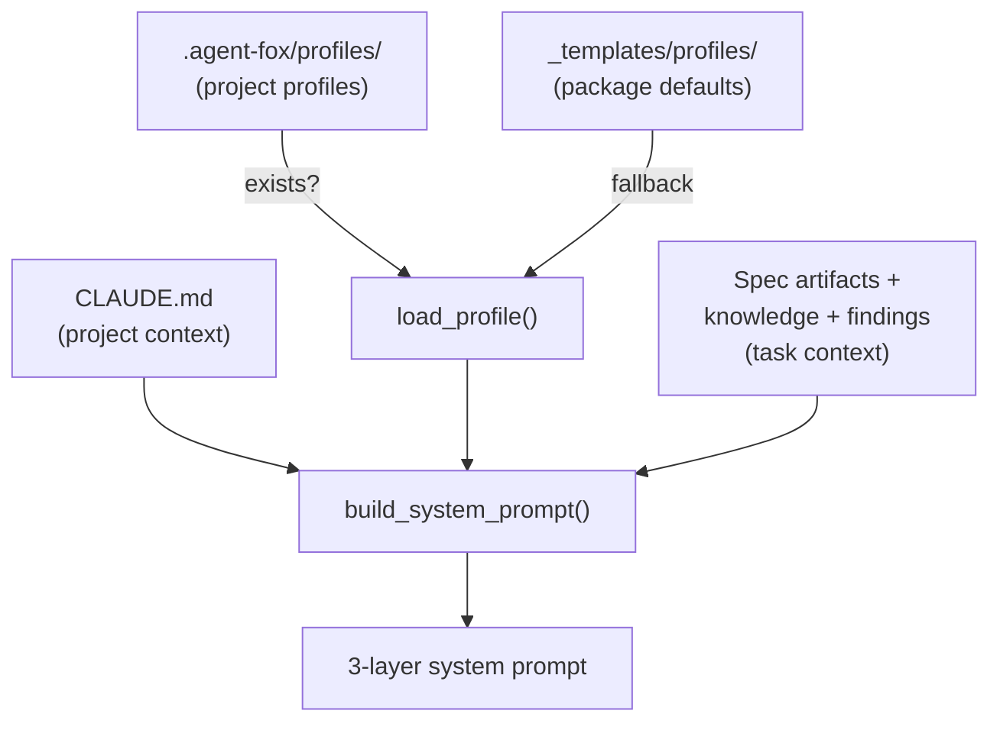

# Design Document: Archetype Profiles

## Overview

This spec adds a profile loading mechanism and restructures prompt assembly
into 3 layers. Default profiles ship with the package; projects can override
them by placing files in `.agent-fox/profiles/`. Custom archetypes are
supported via profiles + permission presets.

## Architecture



### Module Responsibilities

1. **`agent_fox/session/profiles.py`** (NEW) — `load_profile()` function,
   profile resolution logic, custom archetype detection.
2. **`agent_fox/session/prompt.py`** — Updated `build_system_prompt()` for
   3-layer assembly using profiles instead of templates.
3. **`agent_fox/_templates/profiles/`** (NEW) — Default profile files for
   coder, reviewer, verifier, maintainer.
4. **`agent_fox/cli/init.py`** — Updated `init` command with `--profiles`
   flag.
5. **`agent_fox/archetypes.py`** — Updated `get_archetype()` with custom
   archetype fallback.
6. **`agent_fox/core/config.py`** — Custom archetype permission preset
   configuration.

## Execution Paths

### Path 1: Prompt assembly with project profile

```
1. engine/session_lifecycle.py: NodeSessionRunner._build_prompts(repo_root)
2. session/prompt.py: build_system_prompt(context, archetype="coder", project_dir=repo_root)
3. session/profiles.py: load_profile("coder", project_dir=repo_root)
   — checks repo_root/.agent-fox/profiles/coder.md → found, returns content
4. session/prompt.py: reads CLAUDE.md from repo_root → project_context
5. session/prompt.py: assembles task_context from spec artifacts + knowledge
6. session/prompt.py: concatenates project_context + profile + task_context → str
```

### Path 2: Prompt assembly with default profile

```
1. session/prompt.py: build_system_prompt(context, archetype="reviewer", project_dir=repo_root)
2. session/profiles.py: load_profile("reviewer", project_dir=repo_root)
   — checks repo_root/.agent-fox/profiles/reviewer.md → not found
   — loads _templates/profiles/reviewer.md → returns content
3. session/prompt.py: concatenates layers → str
```

### Path 3: Custom archetype session

```
1. graph/types.py: Node(archetype="deployer", mode=None)
2. engine/session_lifecycle.py: NodeSessionRunner(archetype="deployer")
3. archetypes.py: get_archetype("deployer")
   — not in ARCHETYPE_REGISTRY
   — checks for profile at .agent-fox/profiles/deployer.md → found
   — reads permission preset from config: archetype.deployer.permissions = "coder"
   — constructs ArchetypeEntry from coder's permissions + deployer profile
4. session/profiles.py: load_profile("deployer", project_dir) → custom profile content
5. session/prompt.py: builds prompt with custom profile
```

### Path 4: Init --profiles

```
1. cli/init.py: init_cmd(profiles=True)
2. cli/init.py: copies _templates/profiles/*.md to .agent-fox/profiles/
3. cli/init.py: skips existing files, logs preserved message
4. Returns list of created paths
```

## Components and Interfaces

### Profile Loading

```python
# agent_fox/session/profiles.py (NEW)

def load_profile(
    archetype: str,
    project_dir: Path | None = None,
) -> str:
    """Load archetype profile, checking project dir then package default.

    Returns profile content as string (frontmatter stripped).
    Returns empty string if no profile found (with warning logged).
    """
    ...


def has_custom_profile(name: str, project_dir: Path) -> bool:
    """Check if a custom archetype profile exists in the project."""
    ...
```

### Updated Prompt Builder

```python
# agent_fox/session/prompt.py

def build_system_prompt(
    context: SessionContext,
    task_group: int,
    spec_name: str,
    *,
    archetype: str = "coder",
    mode: str | None = None,
    project_dir: Path | None = None,  # NEW
) -> str:
    """Build 3-layer system prompt.

    Layer 1: Project context (CLAUDE.md)
    Layer 2: Archetype profile (from load_profile)
    Layer 3: Task context (spec artifacts, knowledge, findings)
    """
    ...
```

### Custom Archetype Config

```python
# agent_fox/core/config.py

class CustomArchetypeConfig(BaseModel):
    """Configuration for a custom archetype."""
    permissions: str = Field(
        default="coder",
        description="Built-in archetype name whose permissions to inherit",
    )
```

### Updated get_archetype

```python
# agent_fox/archetypes.py

def get_archetype(
    name: str,
    *,
    project_dir: Path | None = None,
    config: AgentFoxConfig | None = None,
) -> ArchetypeEntry:
    """Look up archetype, with custom archetype fallback.

    Resolution order:
    1. ARCHETYPE_REGISTRY[name]
    2. Custom archetype (profile exists + permission preset in config)
    3. Fallback to 'coder' with warning
    """
    ...
```

### Init Command Extension

```python
# agent_fox/cli/init.py

def init_profiles(project_dir: Path) -> list[Path]:
    """Copy default profiles to .agent-fox/profiles/.

    Returns list of created file paths.
    Skips existing files without overwriting.
    """
    ...
```

## Data Models

### Profile File Structure

```markdown
# Coder Profile

## Identity
You are the Coder archetype. Your job is to implement code changes...

## Rules
- Never modify spec files
- Commit each logical change separately
- Run tests before committing

## Focus Areas
- Code correctness and test coverage
- Clean, maintainable implementation
- Adherence to project conventions

## Output Format
- Session summary (what was attempted, succeeded, left incomplete)
- List of files created or modified
- Test results
```

### File Layout

```
agent_fox/_templates/profiles/     # Package defaults
  coder.md
  reviewer.md
  verifier.md
  maintainer.md

.agent-fox/profiles/               # Project overrides (optional)
  coder.md                         # Full replacement if present
  deployer.md                      # Custom archetype
```

### Custom Archetype TOML

```toml
[archetypes.custom.deployer]
permissions = "coder"

[archetypes.custom.researcher]
permissions = "reviewer"
```

## Operational Readiness

- **Migration:** The old template-based prompts are replaced. Teams currently
  relying on CLAUDE.md for all agent guidance see no change — CLAUDE.md
  remains the project context layer. The new profile layer adds
  archetype-specific guidance that was previously hardcoded.
- **Observability:** Profile loading logs the resolved path (project or
  package default) at DEBUG level.
- **Rollback:** Remove `.agent-fox/profiles/` to revert to package defaults.

## Correctness Properties

### Property 1: 3-Layer Order

*For any* prompt built by `build_system_prompt`, the project context (CLAUDE.md
content) SHALL appear before the archetype profile, which SHALL appear before
the task context.

**Validates: Requirements 99-REQ-1.1**

### Property 2: Project Override Precedence

*For any* archetype where both a project profile and a package default exist,
`load_profile` SHALL return the project profile content.

**Validates: Requirements 99-REQ-1.2, 99-REQ-1.3**

### Property 3: Default Profile Completeness

*For any* built-in archetype name in `{"coder", "reviewer", "verifier",
"maintainer"}`, a default profile SHALL exist in the package.

**Validates: Requirements 99-REQ-2.1**

### Property 4: Init Idempotence

*For any* sequence of `init --profiles` calls, existing project profile files
SHALL never be overwritten.

**Validates: Requirements 99-REQ-3.2**

### Property 5: Custom Archetype Permission Inheritance

*For any* custom archetype with `permissions = "X"`, the resolved
`ArchetypeEntry` SHALL have the same allowlist and permission configuration
as the built-in archetype `"X"`.

**Validates: Requirements 99-REQ-4.2, 99-REQ-4.4**

## Error Handling

| Error Condition | Behavior | Requirement |
|----------------|----------|-------------|
| CLAUDE.md missing | Omit project context layer | 99-REQ-1.E1 |
| No profile found (project or default) | Log warning, use empty string | 99-REQ-1.E2 |
| Custom archetype without permission preset | Default to coder permissions with warning | 99-REQ-4.E1 |
| Permission preset references non-existent archetype | Configuration error raised | 99-REQ-4.E2 |
| project_dir is None | Use package default only | 99-REQ-5.E1 |

## Technology Stack

- Python 3.12+
- `importlib.resources` for package-embedded profile loading
- `pathlib` for project-level profile resolution
- `pydantic` v2 for custom archetype config

## Definition of Done

A task group is complete when ALL of the following are true:

1. All subtasks within the group are checked off (`[x]`)
2. All spec tests (`test_spec.md` entries) for the task group pass
3. All property tests for the task group pass
4. All previously passing tests still pass (no regressions)
5. No linter warnings or errors introduced
6. Code is committed on a feature branch and merged into `develop`
7. `tasks.md` checkboxes are updated to reflect completion

## Testing Strategy

- **Unit tests** verify profile loading, prompt assembly, init command, custom
  archetype resolution, and config parsing.
- **Property-based tests** verify layer ordering, override precedence, default
  completeness, init idempotence, and permission inheritance.
- **Integration smoke tests** verify end-to-end prompt assembly with project
  profiles and custom archetype session setup.
