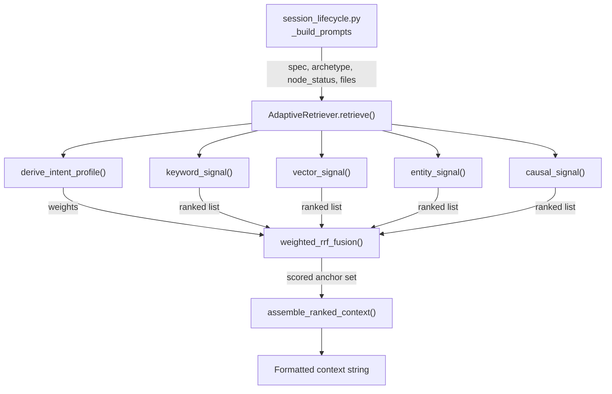
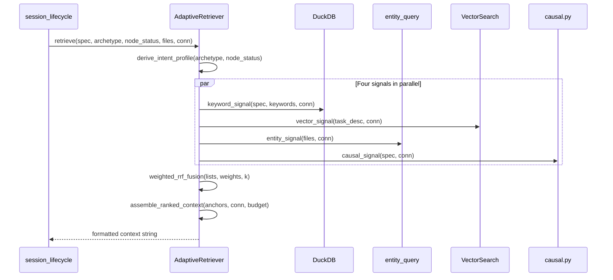

# Design Document: Adaptive Retrieval with Multi-Signal Fusion

## Overview

Replace the sequential, single-signal fact retrieval pipeline with a unified
`AdaptiveRetriever` that queries four signals in parallel (keyword, vector,
entity graph, causal chain), fuses their results via weighted Reciprocal Rank
Fusion, and assembles context with causal ordering and salience-based token
budgeting. The retriever derives per-session signal weights from task context
(archetype, node status, task metadata).

## Architecture





### Module Responsibilities

1. **`agent_fox/knowledge/retrieval.py`** (new) — `AdaptiveRetriever` class,
   `derive_intent_profile`, `weighted_rrf_fusion`, four signal functions,
   `assemble_ranked_context`, `RetrievalConfig` dataclass.
2. **`agent_fox/engine/session_lifecycle.py`** (modified) — Replace the
   `_load_relevant_facts` / `enhance_with_causal` / `_retrieve_cross_spec_facts`
   chain with a single `AdaptiveRetriever.retrieve()` call.
3. **`agent_fox/core/config.py`** (modified) — Add `RetrievalConfig` fields
   to `KnowledgeConfig`.
4. **`agent_fox/knowledge/filtering.py`** (modified) — Remove
   `select_relevant_facts` and `_compute_relevance_score`.
5. **`agent_fox/engine/fact_cache.py`** (modified) — Remove
   `precompute_fact_rankings`, `RankedFactCache`, `get_cached_facts`.

## Execution Paths

### Path 1: Unified retrieval during session prompt assembly

1. `engine/session_lifecycle.py: NodeSessionRunner._build_prompts` — invokes retriever
2. `knowledge/retrieval.py: AdaptiveRetriever.retrieve(spec_name, archetype, node_status, touched_files, task_desc, conn)` → `str`
3. `knowledge/retrieval.py: derive_intent_profile(archetype, node_status)` → `IntentProfile`
4. `knowledge/retrieval.py: _keyword_signal(spec_name, keywords, conn, confidence_threshold)` → `list[ScoredFact]`
5. `knowledge/retrieval.py: _vector_signal(task_desc, conn, embedder)` → `list[ScoredFact]`
6. `knowledge/retrieval.py: _entity_signal(touched_files, conn)` → `list[ScoredFact]`
7. `knowledge/retrieval.py: _causal_signal(spec_name, conn)` → `list[ScoredFact]`
8. `knowledge/retrieval.py: weighted_rrf_fusion(signal_lists, intent_profile, k)` → `list[ScoredFact]`
9. `knowledge/retrieval.py: assemble_ranked_context(anchors, conn, config)` → `str`
10. `session/context.py: assemble_context` — receives formatted string in place of `memory_facts`

### Path 2: Legacy retrieval chain removed

1. `knowledge/filtering.py` — `select_relevant_facts` deleted
2. `engine/session_lifecycle.py` — `enhance_with_causal`, `_retrieve_cross_spec_facts`, `load_relevant_facts` deleted
3. `engine/fact_cache.py` — `precompute_fact_rankings`, `RankedFactCache`, `get_cached_facts` deleted
4. `engine/run.py` — fact cache precomputation removed from `_setup_infrastructure`

## Components and Interfaces

### Data Types

```python
@dataclass(frozen=True)
class ScoredFact:
    """A fact with its per-signal rank and final fused score."""
    fact_id: str
    content: str
    spec_name: str
    confidence: float
    created_at: str
    category: str
    score: float = 0.0  # final weighted RRF score

@dataclass(frozen=True)
class IntentProfile:
    """Per-signal weight multipliers derived from task context."""
    keyword_weight: float = 1.0
    vector_weight: float = 1.0
    entity_weight: float = 1.0
    causal_weight: float = 1.0

@dataclass(frozen=True)
class RetrievalResult:
    """Complete retrieval output for observability."""
    context: str                    # formatted context string
    intent_profile: IntentProfile   # weights used
    anchor_count: int               # facts selected
    signal_counts: dict[str, int]   # per-signal result counts
```

### RetrievalConfig

```python
class RetrievalConfig(BaseModel):
    """Retrieval tuning parameters. Lives under [knowledge.retrieval]."""
    rrf_k: int = 60                 # RRF smoothing constant
    max_facts: int = 50             # maximum facts in anchor set
    token_budget: int = 30_000      # max chars for formatted context
    keyword_top_k: int = 100        # per-signal candidate cap
    vector_top_k: int = 50
    entity_max_depth: int = 2
    entity_max_entities: int = 50
    causal_max_depth: int = 3
```

### AdaptiveRetriever

```python
class AdaptiveRetriever:
    """Unified retriever fusing four signals via weighted RRF."""

    def __init__(
        self,
        conn: duckdb.DuckDBPyConnection,
        config: RetrievalConfig,
        embedder: EmbeddingGenerator | None = None,
    ) -> None: ...

    def retrieve(
        self,
        *,
        spec_name: str,
        archetype: str,
        node_status: str,       # "fresh" | "retry"
        touched_files: list[str],
        task_description: str,
        confidence_threshold: float = 0.5,
    ) -> RetrievalResult: ...
```

### Key Functions

```python
def derive_intent_profile(
    archetype: str,
    node_status: str,
) -> IntentProfile:
    """Derive signal weights from task context.

    Default profiles:
    - coder/fresh:  keyword=1.0, vector=0.8, entity=1.5, causal=1.0
    - coder/retry:  keyword=0.8, vector=0.6, entity=1.0, causal=2.0
    - auditor/*:    keyword=0.6, vector=0.8, entity=2.0, causal=1.0
    - reviewer/*:   keyword=1.0, vector=1.5, entity=0.8, causal=1.0
    - default:      keyword=1.0, vector=1.0, entity=1.0, causal=1.0
    """

def weighted_rrf_fusion(
    signal_lists: dict[str, list[ScoredFact]],
    profile: IntentProfile,
    k: int = 60,
) -> list[ScoredFact]:
    """Fuse ranked lists via weighted RRF. Returns facts sorted by score."""

def assemble_ranked_context(
    anchors: list[ScoredFact],
    conn: duckdb.DuckDBPyConnection,
    config: RetrievalConfig,
) -> str:
    """Format scored facts into ordered context with provenance and budgeting.

    1. Query causal edges between anchor facts for topological ordering.
    2. Topological sort (causes before effects; ties broken by score).
    3. Assign salience tier: top 20% → high, next 40% → medium, rest → low.
    4. Render: high = full content with provenance header;
              medium = one-line summary with provenance;
              low = omitted if budget exceeded.
    5. Truncate to token_budget characters.
    """
```

## Data Models

### Intent Profile Defaults

| Archetype | Node Status | Keyword | Vector | Entity | Causal |
|-----------|------------|---------|--------|--------|--------|
| coder | fresh | 1.0 | 0.8 | 1.5 | 1.0 |
| coder | retry | 0.8 | 0.6 | 1.0 | 2.0 |
| auditor | * | 0.6 | 0.8 | 2.0 | 1.0 |
| reviewer | * | 1.0 | 1.5 | 0.8 | 1.0 |
| verifier | * | 0.8 | 0.6 | 1.5 | 1.5 |
| (default) | * | 1.0 | 1.0 | 1.0 | 1.0 |

### RRF Formula

For each unique fact `d` appearing in any signal's ranked list:

```
score(d) = sum over signals i where d appears:
    profile.weight_i / (k + rank_i(d))
```

Where `rank_i(d)` is the 1-based position of `d` in signal `i`'s list,
`k` is the smoothing constant (default 60), and `profile.weight_i` is the
intent-derived multiplier for signal `i`.

### Context Format

```markdown
## Knowledge Context

### [high] auth_middleware — spec: 03_auth (confidence: 0.9)
The auth middleware must validate JWT tokens before passing requests
to downstream handlers. Previous sessions discovered that the token
refresh logic has a race condition under concurrent requests.

### [medium] session_store — spec: 05_sessions (confidence: 0.7)
Session store uses Redis with 24h TTL; known issue with key collision on rapid reconnect.

<!-- 12 additional facts omitted (token budget) -->
```

### config.toml Section

```toml
[knowledge.retrieval]
rrf_k = 60
max_facts = 50
token_budget = 30000
```

## Operational Readiness

- **Observability:** `RetrievalResult` includes `intent_profile` and
  `signal_counts` for debugging. A `retrieval.complete` audit event can
  be emitted with these fields.
- **Rollout:** The retriever is always active — no feature flag. The old
  chain is removed.
- **Rollback:** Revert the commit that wires `AdaptiveRetriever` into
  `session_lifecycle.py` and restore the old chain functions.
- **Migration:** No schema changes. No data migration.
- **Performance:** Live computation per-session. The four signals are
  independent and could be parallelized (asyncio.gather) in a future
  optimization, but sequential execution is acceptable for v1.

## Correctness Properties

### Property 1: RRF Score Monotonicity

*For any* fact `d` and two signal sets S1 ⊂ S2 where `d` appears in both,
`weighted_rrf_fusion` SHALL assign `d` a score in S2 that is greater than or
equal to its score in S1 (adding signals can only increase a fact's score).

**Validates: Requirements 2.1, 2.E1**

### Property 2: RRF Deduplication

*For any* set of signal lists where the same fact ID appears in multiple
lists, `weighted_rrf_fusion` SHALL produce exactly one entry for that fact
in the output, with a score that aggregates contributions from all signals.

**Validates: Requirements 2.3**

### Property 3: Weight Application

*For any* `IntentProfile` with weight `w_i` for signal `i`, and a fact
appearing at rank `r` in signal `i` only, the fact's score SHALL equal
`w_i / (k + r)`.

**Validates: Requirements 2.1, 3.2**

### Property 4: Graceful Signal Degradation

*For any* combination of signal results where 1 to 3 signals return empty
lists, `weighted_rrf_fusion` SHALL produce results from the non-empty
signals only, without error.

**Validates: Requirements 1.E1, 1.E2**

### Property 5: Causal Ordering Consistency

*For any* anchor set containing facts A and B where A is a causal
predecessor of B in `fact_causes`, `assemble_ranked_context` SHALL place
A before B in the output string.

**Validates: Requirements 4.1**

### Property 6: Token Budget Compliance

*For any* anchor set and token budget, `assemble_ranked_context` SHALL
produce output whose character count does not exceed the configured
`token_budget`.

**Validates: Requirements 4.3**

### Property 7: Default Fallback Profile

*For any* unknown archetype string or missing node status,
`derive_intent_profile` SHALL return the balanced default profile
(all weights 1.0).

**Validates: Requirements 3.E1**

## Error Handling

| Error Condition | Behavior | Requirement |
|----------------|----------|-------------|
| Vector signal fails (embedding/DuckDB error) | Log warning, exclude from RRF | 104-REQ-1.E3 |
| Entity graph tables missing | Entity signal returns empty list | 104-REQ-1.E1 |
| No causal links exist | Causal signal returns empty list | 104-REQ-1.E1 |
| All signals return empty | Return empty context string | 104-REQ-1.E2 |
| Unknown archetype | Use balanced default profile | 104-REQ-3.E1 |
| Missing `[knowledge.retrieval]` config | Use hardcoded defaults | 104-REQ-5.E1 |

## Technology Stack

- Python 3.12+
- DuckDB (existing dependency)
- Standard library: `dataclasses`, `logging`, `collections`
- Existing modules: `knowledge/search.py`, `knowledge/entity_query.py`,
  `knowledge/causal.py`, `knowledge/facts.py`

## Definition of Done

A task group is complete when ALL of the following are true:

1. All subtasks within the group are checked off (`[x]`)
2. All spec tests (`test_spec.md` entries) for the task group pass
3. All property tests for the task group pass
4. All previously passing tests still pass (no regressions)
5. No linter warnings or errors introduced
6. Code is committed on a feature branch and merged into `develop`
7. Feature branch is merged back to `develop`
8. `tasks.md` checkboxes are updated to reflect completion

## Testing Strategy

- **Unit tests** validate each signal function, `weighted_rrf_fusion`,
  `derive_intent_profile`, and `assemble_ranked_context` in isolation using
  in-memory DuckDB fixtures.
- **Property-based tests** (Hypothesis) verify RRF invariants (monotonicity,
  deduplication, weight application) across random signal lists and profiles.
- **Integration tests** run the full `AdaptiveRetriever.retrieve()` pipeline
  with a mock backend and verify the formatted context contains expected
  facts in correct order.
