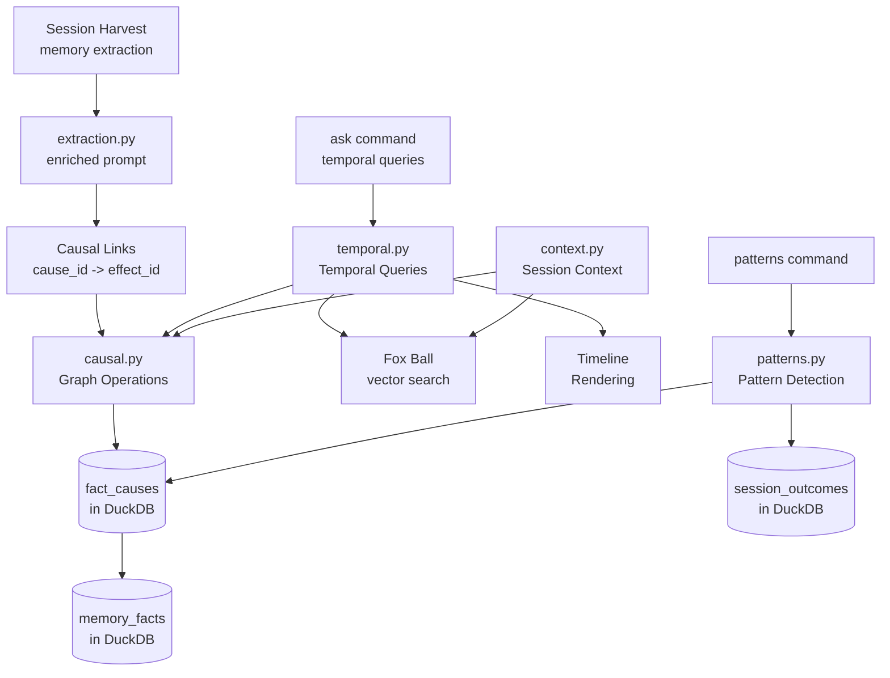

# Design Document: Time Vision -- Temporal Reasoning

## Overview

This spec adds temporal reasoning to the agent-fox knowledge system: causal
graph operations, temporal queries, predictive pattern detection, timeline
rendering, enriched fact extraction, and causal context enhancement. It builds
on the DuckDB knowledge store (spec 11) and Fox Ball (spec 12).

## Architecture



### Module Responsibilities

1. `agent_fox/knowledge/causal.py` -- Causal graph operations: add causal
   link, query causes/effects of a fact, traverse causal chains. Uses the
   `fact_causes` table in DuckDB.
2. `agent_fox/knowledge/temporal.py` -- Temporal queries: given a question,
   find relevant facts via vector search, traverse the causal graph from
   those facts, construct timelines, pass to synthesis model for a grounded
   answer.
3. `agent_fox/knowledge/patterns.py` -- Predictive pattern detection: batch
   analysis of historical co-occurrences in `fact_causes` and
   `session_outcomes`. Returns ranked patterns.
4. `agent_fox/cli/patterns.py` -- `agent-fox patterns` CLI command that
   triggers batch pattern detection and renders results.
5. `agent_fox/memory/extraction.py` (extend) -- Enrich the memory extraction
   prompt to identify cause-effect relationships between current and prior
   facts.
6. `agent_fox/session/context.py` (extend) -- Add causal graph traversal to
   context selection, prioritizing causally-linked facts alongside
   keyword-matched facts.

## Components and Interfaces

### Causal Graph Operations

```python
# agent_fox/knowledge/causal.py
import duckdb
from dataclasses import dataclass
import logging

logger = logging.getLogger("agent_fox.knowledge.causal")


@dataclass(frozen=True)
class CausalLink:
    """A directed edge in the causal graph."""
    cause_id: str   # UUID as string
    effect_id: str  # UUID as string


@dataclass(frozen=True)
class CausalFact:
    """A fact with its position in a causal chain."""
    fact_id: str
    content: str
    spec_name: str | None
    session_id: str | None
    commit_sha: str | None
    created_at: str | None
    depth: int          # 0 = starting fact, positive = effects, negative = causes
    relationship: str   # "root" | "cause" | "effect"


def add_causal_link(
    conn: duckdb.DuckDBPyConnection,
    cause_id: str,
    effect_id: str,
) -> bool:
    """Insert a causal link into fact_causes.

    Validates that both fact IDs exist in memory_facts. Silently ignores
    duplicate links (idempotent). Returns True if a new link was inserted,
    False if it already existed or validation failed.
    """
    ...


def get_causes(
    conn: duckdb.DuckDBPyConnection,
    fact_id: str,
) -> list[CausalFact]:
    """Return all direct causes of the given fact.

    Queries fact_causes WHERE effect_id = fact_id, joining with
    memory_facts for content and provenance.
    """
    ...


def get_effects(
    conn: duckdb.DuckDBPyConnection,
    fact_id: str,
) -> list[CausalFact]:
    """Return all direct effects of the given fact.

    Queries fact_causes WHERE cause_id = fact_id, joining with
    memory_facts for content and provenance.
    """
    ...


def traverse_causal_chain(
    conn: duckdb.DuckDBPyConnection,
    fact_id: str,
    *,
    max_depth: int = 10,
    direction: str = "both",  # "causes" | "effects" | "both"
) -> list[CausalFact]:
    """Traverse the causal graph from a starting fact.

    Performs breadth-first traversal following causal links up to
    max_depth. Returns all reachable facts with their depth relative
    to the starting fact. Causes have negative depth, effects have
    positive depth, the starting fact has depth 0.

    Direction controls traversal:
    - "causes": follow links backward (cause direction only)
    - "effects": follow links forward (effect direction only)
    - "both": follow links in both directions
    """
    ...
```

### Temporal Queries

```python
# agent_fox/knowledge/temporal.py
import duckdb
from dataclasses import dataclass, field
from agent_fox.knowledge.causal import CausalFact, traverse_causal_chain
import logging

logger = logging.getLogger("agent_fox.knowledge.temporal")


@dataclass(frozen=True)
class TimelineNode:
    """A single node in a rendered timeline."""
    fact_id: str
    content: str
    spec_name: str | None
    session_id: str | None
    commit_sha: str | None
    timestamp: str | None
    relationship: str   # "cause" | "effect" | "root"
    depth: int          # indentation level in timeline


@dataclass
class Timeline:
    """An ordered timeline of causally linked facts."""
    nodes: list[TimelineNode] = field(default_factory=list)
    query: str = ""

    def render(self, *, use_color: bool = True) -> str:
        """Render the timeline as indented text.

        Each node is rendered with indentation proportional to its depth.
        When use_color is False (stdout is not a TTY), no ANSI escape
        codes are included.
        """
        ...


def build_timeline(
    conn: duckdb.DuckDBPyConnection,
    seed_fact_ids: list[str],
    *,
    max_depth: int = 10,
) -> Timeline:
    """Construct a timeline from seed facts by traversing the causal graph.

    1. For each seed fact, traverse the causal chain in both directions.
    2. Deduplicate facts that appear in multiple chains.
    3. Sort by timestamp, then by depth within the same timestamp.
    4. Return as a Timeline with ordered TimelineNodes.
    """
    ...


def temporal_query(
    conn: duckdb.DuckDBPyConnection,
    question: str,
    query_embedding: list[float],
    *,
    top_k: int = 20,
    max_depth: int = 10,
) -> Timeline:
    """Execute a temporal query.

    1. Use the query embedding to find the top-k most similar facts
       via vector search (same as Fox Ball ask).
    2. From those seed facts, traverse the causal graph to build a
       timeline.
    3. Return the timeline for rendering and synthesis.
    """
    ...
```

### Predictive Pattern Detection

```python
# agent_fox/knowledge/patterns.py
import duckdb
from dataclasses import dataclass
import logging

logger = logging.getLogger("agent_fox.knowledge.patterns")


@dataclass(frozen=True)
class Pattern:
    """A recurring cause-effect pattern detected in history."""
    trigger: str        # e.g., "changes to src/auth/"
    effect: str         # e.g., "test_payments.py failures"
    occurrences: int    # number of times this pattern was observed
    last_seen: str      # ISO timestamp of most recent occurrence
    confidence: str     # "high" (5+), "medium" (3-4), "low" (2)


def detect_patterns(
    conn: duckdb.DuckDBPyConnection,
    *,
    min_occurrences: int = 2,
) -> list[Pattern]:
    """Detect recurring cause-effect patterns.

    Analysis algorithm:
    1. Query session_outcomes for all sessions, grouping by spec_name
       and touched_path.
    2. For each pair of (path_changed, subsequent_failure), count
       co-occurrences across sessions.
    3. Cross-reference with fact_causes to find causal chains that
       connect the change to the failure.
    4. Rank patterns by occurrence count, then by recency.
    5. Assign confidence: high (5+ occurrences), medium (3-4), low (2).

    Returns patterns sorted by occurrence count descending.
    """
    ...


def render_patterns(patterns: list[Pattern], *, use_color: bool = True) -> str:
    """Render detected patterns as formatted text.

    Each pattern is rendered as:
        trigger -> effect (N occurrences, last seen DATE, confidence LEVEL)

    When use_color is False, no ANSI escape codes are included.
    """
    ...
```

### Patterns CLI Command

```python
# agent_fox/cli/patterns.py
import click
from agent_fox.knowledge.patterns import detect_patterns, render_patterns
import logging

logger = logging.getLogger("agent_fox.cli.patterns")


@click.command("patterns")
@click.option("--min-occurrences", default=2, type=int,
              help="Minimum co-occurrences to report a pattern.")
@click.pass_context
def patterns_cmd(ctx: click.Context, min_occurrences: int) -> None:
    """Detect and display recurring cause-effect patterns.

    Analyzes session history and the causal graph to find recurring
    sequences (e.g., "module X changes -> test Y breaks").
    """
    ...
```

### Extraction Prompt Enrichment

```python
# agent_fox/memory/extraction.py (extend existing module)
#
# The existing extraction prompt is extended with a new section that
# instructs the extraction model to identify cause-effect relationships.
#
# Added to the extraction prompt template:

CAUSAL_EXTRACTION_ADDENDUM = """
## Causal Relationships

Review the facts you have extracted above. For each fact, consider whether
it was CAUSED BY a prior fact from the knowledge base, or whether it CAUSES
a change that affects other known facts.

For each causal relationship you identify, output a JSON object:
{
    "cause_id": "<UUID of the cause fact>",
    "effect_id": "<UUID of the effect fact>"
}

Only include relationships where the causal connection is clear and direct.
Do not speculate. If no causal relationships are apparent, output an empty
list.

Prior facts for reference:
{prior_facts}
"""


def enrich_extraction_with_causal(
    base_prompt: str,
    prior_facts: list[dict],
) -> str:
    """Append causal extraction instructions to the base extraction prompt.

    Formats the prior facts as a reference list and appends the causal
    extraction addendum to the prompt.
    """
    ...


def parse_causal_links(extraction_response: str) -> list[tuple[str, str]]:
    """Parse causal link pairs from the extraction model's response.

    Returns a list of (cause_id, effect_id) tuples. Silently skips
    malformed entries.
    """
    ...
```

### Context Enhancement

```python
# agent_fox/session/context.py (extend existing module)
#
# The existing context selection function is extended to include
# causally-linked facts alongside keyword-matched facts.

def select_context_with_causal(
    conn: duckdb.DuckDBPyConnection,
    spec_name: str,
    touched_files: list[str],
    *,
    keyword_facts: list[dict],
    max_facts: int = 50,
    causal_budget: int = 10,
) -> list[dict]:
    """Select session context facts with causal enhancement.

    1. Start with keyword_facts from the existing selection (REQ-061).
    2. For each keyword fact, query the causal graph for linked facts.
    3. Also query for facts causally linked to the current spec_name.
    4. Deduplicate and rank: keyword matches first, then causal links
       ordered by proximity (depth).
    5. Trim to max_facts total.

    The causal_budget controls how many of the max_facts slots are
    reserved for causally-linked facts (default: 10 of 50).
    """
    ...
```

## Data Models

### DuckDB Tables Used

The `fact_causes` table is created by spec 11. Time Vision populates it:

```sql
-- Temporal causal graph (created by spec 11, populated by spec 13)
CREATE TABLE fact_causes (
    cause_id  UUID,
    effect_id UUID,
    PRIMARY KEY (cause_id, effect_id)
);
```

Time Vision reads from `memory_facts` and `session_outcomes` (created and
populated by specs 11 and 12):

```sql
-- Used for provenance and content in timeline construction
SELECT id, content, spec_name, session_id, commit_sha, created_at
FROM memory_facts
WHERE id = ?;

-- Used for pattern detection
SELECT spec_name, task_group, touched_path, status, created_at
FROM session_outcomes;
```

### Key DuckDB Queries

**Add causal link (with validation):**

```sql
-- Validate both facts exist
SELECT COUNT(*) FROM memory_facts WHERE id IN (?, ?);

-- Insert link (idempotent via INSERT OR IGNORE)
INSERT INTO fact_causes (cause_id, effect_id)
VALUES (?, ?)
ON CONFLICT DO NOTHING;
```

**Get direct causes:**

```sql
SELECT f.id, f.content, f.spec_name, f.session_id, f.commit_sha, f.created_at
FROM fact_causes fc
JOIN memory_facts f ON f.id = fc.cause_id
WHERE fc.effect_id = ?
ORDER BY f.created_at;
```

**Get direct effects:**

```sql
SELECT f.id, f.content, f.spec_name, f.session_id, f.commit_sha, f.created_at
FROM fact_causes fc
JOIN memory_facts f ON f.id = fc.effect_id
WHERE fc.cause_id = ?
ORDER BY f.created_at;
```

**Traverse causal chain (BFS, application-level):**

The causal chain traversal is implemented as breadth-first search at the
application level rather than a recursive SQL CTE. This is because:
1. DuckDB recursive CTEs have limited depth control.
2. Application-level BFS allows cycle detection and precise depth tracking.
3. The graph is small (hundreds to low thousands of facts).

```python
def traverse_causal_chain(conn, fact_id, *, max_depth=10, direction="both"):
    visited = set()
    queue = deque([(fact_id, 0)])  # (id, depth)
    result = []

    while queue:
        current_id, depth = queue.popleft()
        if current_id in visited or abs(depth) > max_depth:
            continue
        visited.add(current_id)

        fact = fetch_fact(conn, current_id)
        if fact is None:
            continue

        relationship = "root" if depth == 0 else ("cause" if depth < 0 else "effect")
        result.append(CausalFact(
            fact_id=current_id,
            content=fact["content"],
            spec_name=fact["spec_name"],
            session_id=fact["session_id"],
            commit_sha=fact["commit_sha"],
            created_at=fact["created_at"],
            depth=depth,
            relationship=relationship,
        ))

        if direction in ("effects", "both"):
            for effect in get_direct_effects(conn, current_id):
                queue.append((effect.fact_id, depth + 1))

        if direction in ("causes", "both"):
            for cause in get_direct_causes(conn, current_id):
                queue.append((cause.fact_id, depth - 1))

    return sorted(result, key=lambda f: (f.created_at or "", f.depth))
```

**Pattern detection query:**

```sql
-- Find (path_changed, spec_with_failure) co-occurrences
SELECT
    changed.touched_path AS trigger_path,
    failed.spec_name     AS failed_spec,
    COUNT(*)             AS occurrences,
    MAX(failed.created_at) AS last_seen
FROM session_outcomes changed
JOIN session_outcomes failed
    ON changed.spec_name != failed.spec_name
    AND changed.created_at <= failed.created_at
    AND failed.created_at <= changed.created_at + INTERVAL 1 DAY
    AND failed.status = 'failed'
    AND changed.status = 'completed'
WHERE changed.touched_path IS NOT NULL
GROUP BY changed.touched_path, failed.spec_name
HAVING COUNT(*) >= ?
ORDER BY occurrences DESC, last_seen DESC;
```

### Timeline Rendering Algorithm

```
Input: list of TimelineNode, sorted by timestamp then depth

For each node:
    indent = "  " * max(0, node.depth)
    connector = "-> " if node.relationship == "effect" else
                "<- " if node.relationship == "cause" else
                "** "

    line_1 = f"{indent}{connector}{node.content}"
    line_2 = f"{indent}   [{node.timestamp}] spec:{node.spec_name} "
             f"session:{node.session_id} commit:{node.commit_sha or 'n/a'}"
    output line_1
    output line_2

Example output:

    ** User.email column changed to nullable
       [2025-11-03T14:22:00] spec:07_oauth session:07/3 commit:a1b2c3d
      -> spec 09 test_user_model.py assertions failed
         [2025-11-17T09:15:00] spec:09_user_tests session:09/1 commit:e4f5g6h
        -> Added migration to handle nullable email in auth flow
           [2025-11-18T11:30:00] spec:12_auth_fix session:12/2 commit:i7j8k9l
```

## Correctness Properties

### Property 1: Causal Link Referential Integrity

*For any* causal link `(cause_id, effect_id)` inserted via `add_causal_link()`,
both `cause_id` and `effect_id` SHALL exist in the `memory_facts` table at the
time of insertion. Links referencing non-existent facts SHALL be rejected.

**Validates:** 13-REQ-3.1, 13-REQ-2.E2

### Property 2: Causal Link Idempotency

*For any* causal link `(cause_id, effect_id)`, inserting the same link twice
SHALL result in exactly one row in `fact_causes`. The second insert SHALL
succeed without error.

**Validates:** 13-REQ-3.E1

### Property 3: Traversal Depth Bound

*For any* call to `traverse_causal_chain(conn, fact_id, max_depth=N)`, the
returned list SHALL contain no fact with `abs(depth) > N`.

**Validates:** 13-REQ-3.4

### Property 4: Traversal Completeness

*For any* fact F in a causal chain of depth <= max_depth reachable from the
starting fact via cause-effect links in the specified direction, F SHALL appear
in the traversal result.

**Validates:** 13-REQ-3.2, 13-REQ-3.3, 13-REQ-3.4

### Property 5: Timeline Ordering

*For any* timeline produced by `build_timeline()`, nodes SHALL be ordered by
timestamp (ascending), with depth as a tiebreaker within the same timestamp.

**Validates:** 13-REQ-6.1, 13-REQ-6.2

### Property 6: Pattern Minimum Threshold

*For any* call to `detect_patterns(conn, min_occurrences=N)`, every returned
pattern SHALL have `occurrences >= N`.

**Validates:** 13-REQ-5.1, 13-REQ-5.2

### Property 7: Context Budget Compliance

*For any* call to `select_context_with_causal()` with `max_facts=M`, the
returned list SHALL contain at most M facts.

**Validates:** 13-REQ-7.2

### Property 8: Extraction Failure Non-Fatal

*For any* failure in causal link extraction (parsing error, empty response),
the session's facts SHALL still be stored successfully. The failure SHALL be
logged but SHALL not propagate as an exception to the session runner.

**Validates:** 13-REQ-2.E1

## Error Handling

| Error Condition | Behavior | Requirement |
|----------------|----------|-------------|
| Extraction model returns no causal links | Facts stored without causal metadata; info logged | 13-REQ-2.E1 |
| Causal link references non-existent fact | Link skipped; warning logged | 13-REQ-2.E2 |
| Duplicate causal link inserted | Silently ignored (ON CONFLICT DO NOTHING) | 13-REQ-3.E1 |
| DuckDB unavailable during causal write | Warning logged; facts stored without links | 13-REQ-2.E1 |
| DuckDB unavailable during temporal query | KnowledgeStoreError raised to caller | 11-REQ-7.1 |
| No patterns detected | User-facing message; exit code 0 | 13-REQ-5.E1 |
| Causal graph has no links for queried facts | Timeline returned with seed facts only (no chain) | 13-REQ-4.1 |
| Malformed causal link JSON in extraction response | Entry skipped; warning logged | 13-REQ-2.E1 |

## Technology Stack

| Technology | Version | Purpose |
|-----------|---------|---------|
| duckdb | >=1.0 | Causal graph storage and querying |
| Python | 3.12+ | Runtime |
| Click | 8.1+ | CLI for patterns command |
| pytest | 8.0+ | Test framework |
| hypothesis | 6.0+ | Property-based testing |

## Definition of Done

A task group is complete when ALL of the following are true:

1. All subtasks within the group are checked off (`[x]`)
2. All spec tests (`test_spec.md` entries) for the task group pass
3. All property tests for the task group pass
4. All previously passing tests still pass (no regressions)
5. No linter warnings or errors introduced
6. Code is committed on a feature branch and pushed to remote
7. Feature branch is merged back to `develop`
8. `tasks.md` checkboxes are updated to reflect completion

## Testing Strategy

- **Unit tests** validate individual functions: causal link insertion, graph
  traversal, timeline construction, pattern detection, extraction prompt
  enrichment, context enhancement.
- **Property tests** (Hypothesis) verify invariants: referential integrity,
  idempotency, depth bounds, timeline ordering, pattern thresholds, context
  budget compliance.
- **All DuckDB tests use in-memory databases** (`duckdb.connect(":memory:")`)
  with seeded causal data to avoid polluting the real knowledge store.
- **Extraction tests use mock model responses** -- no real API calls.
- **No network dependencies** in tests.
