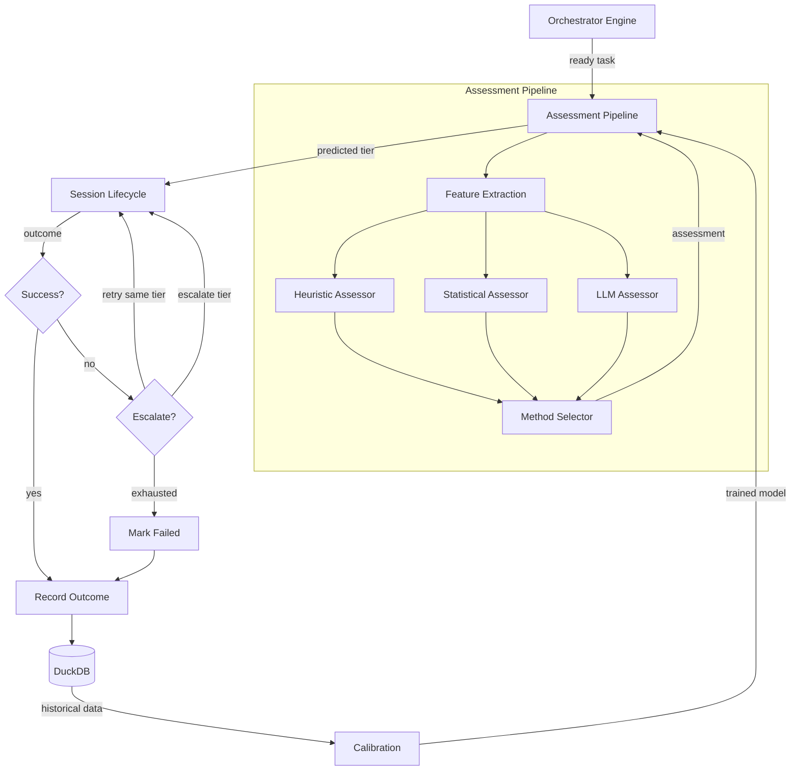
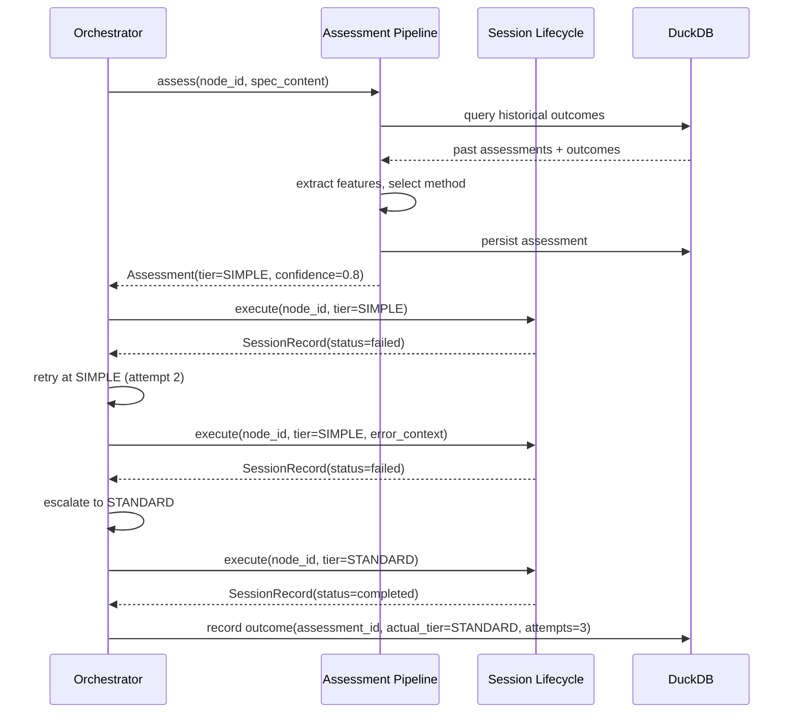

# Design Document: Adaptive Model Routing

## Overview

Adaptive Model Routing introduces a two-layer model selection system into
agent-fox's orchestration pipeline. The first layer (complexity assessment)
predicts the appropriate model tier for a task group before execution. The
second layer (speculative execution) handles escalation when the predicted
tier proves insufficient. A calibration loop compares predictions against
outcomes and trains a statistical model to improve future routing decisions.

The system operates at the **task-group level** — each task group gets one
assessment, and escalation happens between full session attempts (not within
a session). All data flows through the existing DuckDB knowledge store.

## Architecture





### Module Responsibilities

1. **`agent_fox/routing/`** — New package for adaptive routing logic.
2. **`agent_fox/routing/assessor.py`** — Assessment pipeline: feature extraction,
   heuristic/statistical/LLM assessors, method selection.
3. **`agent_fox/routing/calibration.py`** — Statistical model training,
   cross-validation, accuracy tracking, retraining triggers.
4. **`agent_fox/routing/escalation.py`** — Escalation ladder: retry-at-tier,
   escalate-to-next-tier, tier ceiling enforcement.
5. **`agent_fox/routing/storage.py`** — DuckDB CRUD for `complexity_assessments`
   and `execution_outcomes` tables.
6. **`agent_fox/routing/features.py`** — Feature vector extraction from spec
   content (subtask count, word count, etc.).
7. **`agent_fox/core/config.py`** — Extended with `RoutingConfig` model.
8. **`agent_fox/engine/engine.py`** — Modified orchestrator loop with escalation
   ladder replacing simple retry logic.
9. **`agent_fox/engine/session_lifecycle.py`** — Modified `NodeSessionRunner` to
   accept tier from assessment instead of static resolution.

## Components and Interfaces

### Configuration

```python
class RoutingConfig(BaseModel):
    retries_before_escalation: int = 1      # [0, 3]
    training_threshold: int = 20            # [5, 1000]
    accuracy_threshold: float = 0.75        # [0.5, 1.0]
    retrain_interval: int = 10              # [5, 100]
```

### Data Types

```python
@dataclass(frozen=True)
class FeatureVector:
    subtask_count: int
    spec_word_count: int
    has_property_tests: bool
    edge_case_count: int
    dependency_count: int
    archetype: str

@dataclass(frozen=True)
class ComplexityAssessment:
    id: str                          # UUID
    node_id: str
    spec_name: str
    task_group: int
    predicted_tier: ModelTier
    confidence: float                # [0.0, 1.0]
    assessment_method: str           # "heuristic" | "statistical" | "llm" | "hybrid"
    feature_vector: FeatureVector
    tier_ceiling: ModelTier
    created_at: datetime

@dataclass(frozen=True)
class ExecutionOutcome:
    id: str                          # UUID
    assessment_id: str               # FK to ComplexityAssessment
    actual_tier: ModelTier
    total_tokens: int
    total_cost: float
    duration_ms: int
    attempt_count: int
    escalation_count: int
    outcome: str                     # "completed" | "failed"
    files_touched_count: int
    created_at: datetime
```

### Assessment Pipeline Interface

```python
class AssessmentPipeline:
    def __init__(
        self,
        config: RoutingConfig,
        db: KnowledgeDB | None,
    ) -> None: ...

    async def assess(
        self,
        node_id: str,
        spec_name: str,
        task_group: int,
        spec_dir: Path,
        archetype: str,
        tier_ceiling: ModelTier,
    ) -> ComplexityAssessment:
        """Produce a complexity assessment for a task group."""

    def record_outcome(
        self,
        assessment: ComplexityAssessment,
        actual_tier: ModelTier,
        total_tokens: int,
        total_cost: float,
        duration_ms: int,
        attempt_count: int,
        escalation_count: int,
        outcome: str,
        files_touched_count: int,
    ) -> None:
        """Record execution outcome and trigger retraining if needed."""
```

### Escalation Ladder Interface

```python
class EscalationLadder:
    def __init__(
        self,
        starting_tier: ModelTier,
        tier_ceiling: ModelTier,
        retries_before_escalation: int,
    ) -> None: ...

    @property
    def current_tier(self) -> ModelTier: ...

    @property
    def is_exhausted(self) -> bool: ...

    @property
    def attempt_count(self) -> int: ...

    @property
    def escalation_count(self) -> int: ...

    def record_failure(self) -> None:
        """Record a failure. Advances retry count or escalates tier."""

    def should_retry(self) -> bool:
        """True if there are remaining retries or escalation steps."""
```

### Feature Extraction Interface

```python
def extract_features(
    spec_dir: Path,
    task_group: int,
    archetype: str,
) -> FeatureVector:
    """Extract feature vector from spec content for the given task group."""
```

### Heuristic Assessor

```python
def heuristic_assess(features: FeatureVector) -> tuple[ModelTier, float]:
    """Rule-based tier prediction.

    Rules:
    - SIMPLE: subtask_count <= 3 AND spec_word_count < 500 AND no property tests
    - ADVANCED: subtask_count >= 6 OR dependency_count >= 3 OR has_property_tests
    - STANDARD: everything else

    Returns (predicted_tier, confidence).
    Confidence is 0.6 for heuristic (fixed — reflects low certainty).
    """
```

### Statistical Assessor

```python
class StatisticalAssessor:
    def __init__(self, db: KnowledgeDB) -> None: ...

    def is_ready(self, training_threshold: int) -> bool:
        """True if enough data points exist for training."""

    def train(self) -> float:
        """Train logistic regression on historical data. Returns accuracy."""

    def predict(self, features: FeatureVector) -> tuple[ModelTier, float]:
        """Predict tier with confidence from trained model."""
```

### LLM Assessor

```python
async def llm_assess(
    spec_dir: Path,
    task_group: int,
    features: FeatureVector,
    model: str,
) -> tuple[ModelTier, float]:
    """Use an LLM to assess task complexity.

    Sends a structured prompt with the task group's spec content
    and feature summary. Parses the LLM response for a tier prediction
    and confidence. Uses the SIMPLE tier model for cost efficiency.
    """
```

## Data Models

### DuckDB Schema

```sql
CREATE TABLE IF NOT EXISTS complexity_assessments (
    id              VARCHAR PRIMARY KEY,
    node_id         VARCHAR NOT NULL,
    spec_name       VARCHAR NOT NULL,
    task_group      INTEGER NOT NULL,
    predicted_tier  VARCHAR NOT NULL,
    confidence      FLOAT NOT NULL,
    assessment_method VARCHAR NOT NULL,
    feature_vector  JSON NOT NULL,
    tier_ceiling    VARCHAR NOT NULL,
    created_at      TIMESTAMP NOT NULL DEFAULT current_timestamp
);

CREATE TABLE IF NOT EXISTS execution_outcomes (
    id                  VARCHAR PRIMARY KEY,
    assessment_id       VARCHAR NOT NULL REFERENCES complexity_assessments(id),
    actual_tier         VARCHAR NOT NULL,
    total_tokens        INTEGER NOT NULL,
    total_cost          FLOAT NOT NULL,
    duration_ms         INTEGER NOT NULL,
    attempt_count       INTEGER NOT NULL,
    escalation_count    INTEGER NOT NULL,
    outcome             VARCHAR NOT NULL,
    files_touched_count INTEGER NOT NULL,
    created_at          TIMESTAMP NOT NULL DEFAULT current_timestamp
);
```

### Configuration Schema

```toml
[routing]
retries_before_escalation = 1   # 0-3: retries at same tier before escalating
training_threshold = 20         # 5-1000: min data points before training
accuracy_threshold = 0.75       # 0.5-1.0: min accuracy to prefer statistical
retrain_interval = 10           # 5-100: new outcomes before retraining
```

## Operational Readiness

### Observability

- Assessment predictions logged at INFO level with node_id, predicted tier,
  confidence, and method.
- Escalation events logged at WARNING level with node_id, from-tier, to-tier.
- Calibration retraining logged at INFO level with new accuracy score.
- Statistical model accuracy degradation logged at WARNING level.

### Rollout / Rollback

- The feature is default-on. To emulate pre-adaptive behavior, set
  `retries_before_escalation = 0` and configure archetype model tiers
  explicitly (which become ceilings and starting tiers simultaneously when
  the assessor defaults to the ceiling on zero history).
- No data migration needed for rollback — the DuckDB tables are additive.

### Migration / Compatibility

- New DuckDB tables added via migration system (existing pattern).
- `OrchestratorConfig.max_retries` is deprecated but still read: if set, it
  is used as a fallback for `retries_before_escalation` with a deprecation
  warning. New `[routing]` config takes precedence.

## Correctness Properties

### Property 1: Escalation Order Preservation

*For any* sequence of failures for a task group, the escalation ladder SHALL
produce tiers in strictly non-decreasing order (SIMPLE <= STANDARD <= ADVANCED),
never skipping tiers or going backward.

**Validates: Requirements 2.1, 2.2**

### Property 2: Tier Ceiling Enforcement

*For any* complexity assessment and escalation sequence, the system SHALL never
select or escalate to a tier above the configured tier ceiling for that
archetype.

**Validates: Requirements 2.4, 5.3**

### Property 3: Retry Budget Correctness

*For any* escalation ladder with retries_before_escalation = R, the total number
of attempts at each tier SHALL be exactly R + 1 (one initial attempt plus R
retries) before escalating, and the total attempt count across all tiers SHALL
be (R + 1) * number_of_tiers_traversed.

**Validates: Requirements 2.1, 2.2, 2.3**

### Property 4: Assessment Persistence Completeness

*For any* task group that enters the assessment pipeline, the system SHALL
persist exactly one complexity assessment record before execution begins, and
exactly one execution outcome record after execution completes (success or
final failure).

**Validates: Requirements 1.6, 3.1, 3.2**

### Property 5: Feature Vector Determinism

*For any* given spec directory, task group, and archetype, the feature extraction
function SHALL produce identical feature vectors across invocations (no
randomness, no dependency on external mutable state).

**Validates: Requirements 1.2**

### Property 6: Method Selection Consistency

*For any* system state where the statistical model accuracy exceeds the
configured threshold, the assessment method SHALL be `statistical`. For any
state where it does not but history exceeds the training threshold, the method
SHALL be `hybrid`. For any state below the training threshold, the method SHALL
be `heuristic`.

**Validates: Requirements 1.3, 1.4, 1.5**

### Property 7: Graceful Degradation

*For any* failure in the assessment pipeline (LLM timeout, DuckDB unavailable,
feature extraction error), the system SHALL still produce a valid tier
prediction (falling back to heuristic or archetype default) and SHALL NOT block
task execution.

**Validates: Requirements 1.E1, 1.E2, 1.E3, 7.E1**

### Property 8: Cost Accounting Completeness

*For any* escalation sequence, the cumulative cost reported to the circuit
breaker SHALL equal the sum of costs from all attempts (including failed
lower-tier attempts), not just the final successful attempt.

**Validates: Requirements 2.5**

### Property 9: Configuration Clamping

*For any* routing configuration values, the system SHALL clamp out-of-range
values to valid bounds and log a warning, matching the existing config
clamping pattern.

**Validates: Requirements 5.1, 5.2, 5.E1, 5.E2**

## Error Handling

| Error Condition | Behavior | Requirement |
|----------------|----------|-------------|
| LLM assessment call fails | Fall back to heuristic, log warning | 30-REQ-1.E1 |
| DuckDB unavailable during assessment | Use heuristic only, skip persistence | 30-REQ-1.E2 |
| Feature extraction fails | Use default values, confidence = 0.0 | 30-REQ-1.E3 |
| Assessment predicted ADVANCED | No escalation, same-tier retries only | 30-REQ-2.E1 |
| Tier ceiling = SIMPLE | No escalation, same-tier retries only | 30-REQ-2.E2 |
| DuckDB unavailable during outcome recording | Log warning, continue | 30-REQ-3.E1 |
| Statistical model training fails | Fall back to heuristic, log warning | 30-REQ-4.E1 |
| Statistical accuracy degrades | Revert to hybrid, log warning | 30-REQ-4.E2 |
| Invalid routing config type | Raise ConfigError | 30-REQ-5.E2 |
| Missing [routing] section | Use defaults | 30-REQ-5.E1 |
| DuckDB schema already exists | Skip creation (idempotent) | 30-REQ-6.E1 |
| Assessment pipeline unhandled exception | Fall back to archetype default tier | 30-REQ-7.E1 |

## Technology Stack

- **Python 3.12+** — project standard
- **DuckDB** — existing knowledge store, extended with new tables
- **scikit-learn** — logistic regression for the statistical model (new
  dependency; lightweight, well-maintained, no GPU required)
- **pydantic** — configuration validation (existing)
- **Claude API** — LLM assessor uses the SIMPLE tier model for cost-efficient
  complexity assessment (existing dependency)

## Definition of Done

A task group is complete when ALL of the following are true:

1. All subtasks within the group are checked off (`[x]`)
2. All spec tests (`test_spec.md` entries) for the task group pass
3. All property tests for the task group pass
4. All previously passing tests still pass (no regressions)
5. No linter warnings or errors introduced
6. Code is committed on a feature branch and pushed to remote
7. Feature branch is merged back to `develop`
8. `tasks.md` checkboxes are updated to reflect completion

## Testing Strategy

- **Unit tests**: Each assessor (heuristic, statistical, LLM), feature
  extraction, escalation ladder, storage CRUD, configuration validation.
- **Property tests**: Escalation order (Property 1), tier ceiling (Property 2),
  retry budget (Property 3), feature determinism (Property 5), method selection
  (Property 6), config clamping (Property 9) — using Hypothesis.
- **Integration tests**: Full assessment → execution → outcome → retraining
  cycle with a real DuckDB instance. Orchestrator loop with mock session
  backend verifying escalation behavior end-to-end.
