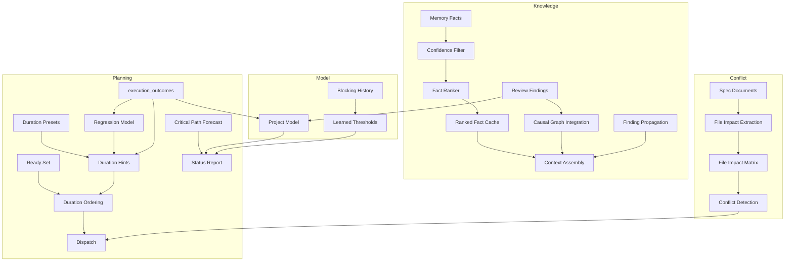

# Design Document: Predictive Planning and Knowledge Usage

## Overview

This spec adds predictive intelligence to agent-fox's planning and dispatch
systems. It introduces duration-based task ordering with a regression model,
integrates review findings into the causal knowledge graph, adds confidence-
aware fact filtering, pre-computes fact rankings, builds a project-level
aggregate model, computes critical paths, detects file conflicts between
parallel tasks, and learns optimal blocking thresholds.

## Architecture



### Module Responsibilities

1. **`routing/duration.py`** (new) — Duration hint computation: historical
   median lookup, preset fallback, regression model training and prediction.
2. **`routing/duration_presets.py`** (new) — Configurable default duration
   estimates per archetype and complexity tier.
3. **`engine/graph_sync.py`** — Updated `ready_tasks()` to accept and apply
   duration-based ordering.
4. **`knowledge/causal.py`** — Extended traversal to include review findings.
5. **`memory/filter.py`** — Confidence threshold filtering before scoring.
6. **`engine/fact_cache.py`** (new) — Pre-computed ranked fact cache.
7. **`session/prompt.py`** — Cross-task-group finding propagation.
8. **`knowledge/project_model.py`** (new) — Aggregate project metrics.
9. **`graph/critical_path.py`** (new) — Critical path computation with
   duration weights.
10. **`graph/file_impacts.py`** (new) — File impact extraction and conflict
    detection.
11. **`session/convergence.py`** — Learned blocking threshold integration.
12. **`knowledge/blocking_history.py`** (new) — Blocking decision tracking
    and threshold learning.

## Components and Interfaces

### Duration Hints

```python
# routing/duration.py

@dataclass
class DurationHint:
    node_id: str
    predicted_ms: int
    source: str  # "historical" | "regression" | "preset" | "default"

def get_duration_hint(
    conn: duckdb.DuckDBPyConnection,
    node_id: str,
    spec_name: str,
    archetype: str,
    tier: str,
    min_outcomes: int = 10,
) -> DurationHint:
    """Get predicted duration for a task node."""

def train_duration_model(
    conn: duckdb.DuckDBPyConnection,
    min_outcomes: int = 30,
) -> LinearRegression | None:
    """Train a duration regression model from execution outcomes."""
```

### Duration Presets

```python
# routing/duration_presets.py

DURATION_PRESETS: dict[str, dict[str, int]] = {
    # archetype -> tier -> estimated duration in ms
    "coder": {
        "STANDARD": 180_000,    # 3 minutes
        "ADVANCED": 600_000,    # 10 minutes
        "MAX": 1_200_000,       # 20 minutes
    },
    "skeptic": {
        "STANDARD": 120_000,    # 2 minutes
    },
    "oracle": {
        "STANDARD": 90_000,     # 1.5 minutes
    },
    "verifier": {
        "STANDARD": 180_000,    # 3 minutes
    },
    # ... librarian, cartographer
}

DEFAULT_DURATION_MS: int = 300_000  # 5 minutes fallback
```

### Extended Causal Traversal

```python
# knowledge/causal.py (extended)

def traverse_with_reviews(
    conn: duckdb.DuckDBPyConnection,
    fact_id: str,
    *,
    max_depth: int = 3,
    direction: str = "both",
) -> list[CausalFact | ReviewFinding | DriftFinding]:
    """Traverse causal chain including review findings."""
```

### Confidence-Aware Filtering

```python
# memory/filter.py (updated)

def select_relevant_facts(
    all_facts: list[Fact],
    spec_name: str,
    task_keywords: list[str],
    budget: int = MAX_CONTEXT_FACTS,
    confidence_threshold: float = 0.5,
) -> list[Fact]:
    """Select relevant facts, filtering by confidence first."""
```

### Fact Cache

```python
# engine/fact_cache.py (new)

@dataclass
class RankedFactCache:
    spec_name: str
    ranked_facts: list[Fact]
    created_at: str
    fact_count_at_creation: int

def precompute_fact_rankings(
    conn: duckdb.DuckDBPyConnection,
    spec_names: list[str],
    confidence_threshold: float = 0.5,
) -> dict[str, RankedFactCache]:
    """Pre-compute and cache ranked facts for all specs."""

def get_cached_facts(
    cache: dict[str, RankedFactCache],
    spec_name: str,
    current_fact_count: int,
) -> list[Fact] | None:
    """Return cached facts if still valid, None if stale."""
```

### Project Model

```python
# knowledge/project_model.py (new)

@dataclass
class SpecMetrics:
    spec_name: str
    avg_cost: float
    avg_duration_ms: int
    failure_rate: float
    session_count: int

@dataclass
class ProjectModel:
    spec_outcomes: dict[str, SpecMetrics]
    module_stability: dict[str, float]  # spec -> finding density
    archetype_effectiveness: dict[str, float]  # archetype -> success rate
    knowledge_staleness: dict[str, int]  # spec -> days since last session
    active_drift_areas: list[str]  # specs with recent oracle drift

def build_project_model(conn: duckdb.DuckDBPyConnection) -> ProjectModel:
    """Aggregate project metrics from execution history."""
```

### Critical Path

```python
# graph/critical_path.py (new)

@dataclass
class CriticalPathResult:
    path: list[str]  # node_ids in order
    total_duration_ms: int
    tied_paths: list[list[str]]  # additional paths with same duration

def compute_critical_path(
    nodes: dict[str, str],  # node_id -> status
    edges: dict[str, list[str]],  # node_id -> predecessors
    duration_hints: dict[str, int],  # node_id -> predicted_ms
) -> CriticalPathResult:
    """Compute critical path using forward/backward pass."""
```

### File Impact Detection

```python
# graph/file_impacts.py (new)

@dataclass
class FileImpact:
    node_id: str
    predicted_files: set[str]

def extract_file_impacts(
    spec_dir: Path,
    task_group: int,
) -> set[str]:
    """Extract predicted file modifications from spec documents."""

def detect_conflicts(
    impacts: list[FileImpact],
) -> list[tuple[str, str, set[str]]]:
    """Find pairs of nodes with overlapping file predictions.
    Returns: list of (node_a, node_b, overlapping_files).
    """
```

### Learned Blocking Thresholds

```python
# knowledge/blocking_history.py (new)

@dataclass
class BlockingDecision:
    spec_name: str
    archetype: str  # "skeptic" | "oracle"
    critical_count: int
    threshold: int
    blocked: bool
    outcome: str  # "correct_block" | "false_positive" | "correct_pass" | "missed_block"

def record_blocking_decision(
    conn: duckdb.DuckDBPyConnection,
    decision: BlockingDecision,
) -> None:
    """Record a blocking decision for threshold learning."""

def compute_optimal_threshold(
    conn: duckdb.DuckDBPyConnection,
    archetype: str,
    min_decisions: int = 20,
    max_false_negative_rate: float = 0.1,
) -> int | None:
    """Compute optimal threshold from blocking history."""
```

## Data Models

### New DuckDB Tables

```sql
-- Fact cache (ephemeral, rebuilt at plan time)
CREATE TABLE IF NOT EXISTS ranked_fact_cache (
    spec_name VARCHAR NOT NULL,
    fact_id UUID NOT NULL,
    rank INTEGER NOT NULL,
    relevance_score FLOAT NOT NULL,
    created_at TIMESTAMP DEFAULT current_timestamp,
    PRIMARY KEY (spec_name, fact_id)
);

-- File impact predictions
CREATE TABLE IF NOT EXISTS task_file_impacts (
    node_id VARCHAR NOT NULL,
    file_path VARCHAR NOT NULL,
    source VARCHAR NOT NULL,  -- "tasks_md" | "design_md" | "heuristic"
    created_at TIMESTAMP DEFAULT current_timestamp,
    PRIMARY KEY (node_id, file_path)
);

-- Blocking decision history
CREATE TABLE IF NOT EXISTS blocking_history (
    id VARCHAR PRIMARY KEY,
    spec_name VARCHAR NOT NULL,
    archetype VARCHAR NOT NULL,
    critical_count INTEGER NOT NULL,
    threshold INTEGER NOT NULL,
    blocked BOOLEAN NOT NULL,
    outcome VARCHAR,  -- filled in after execution completes
    created_at TIMESTAMP DEFAULT current_timestamp
);

-- Learned thresholds
CREATE TABLE IF NOT EXISTS learned_thresholds (
    archetype VARCHAR PRIMARY KEY,
    threshold INTEGER NOT NULL,
    confidence FLOAT NOT NULL,
    sample_count INTEGER NOT NULL,
    updated_at TIMESTAMP DEFAULT current_timestamp
);
```

### Configuration Extensions

```toml
[knowledge]
confidence_threshold = 0.5        # minimum confidence for fact inclusion
fact_cache_enabled = true          # pre-compute fact rankings at plan time

[planning]
duration_ordering = true           # sort ready tasks by predicted duration
min_outcomes_for_historical = 10   # minimum outcomes before using historical data
min_outcomes_for_regression = 30   # minimum outcomes before training regression
file_conflict_detection = false    # detect file conflicts between parallel tasks

[blocking]
learn_thresholds = false           # learn blocking thresholds from history
min_decisions_for_learning = 20    # minimum blocking decisions before learning
max_false_negative_rate = 0.1      # maximum acceptable false negative rate
```

## Correctness Properties

### Property 1: Duration Ordering Correctness

*For any* set of ready tasks with duration hints, the ordering SHALL place
tasks with higher predicted durations before tasks with lower predicted
durations. Tasks with equal durations SHALL maintain stable alphabetical
order.

**Validates: Requirements 39-REQ-1.1, 39-REQ-1.3**

### Property 2: Duration Hint Source Precedence

*For any* task node, `get_duration_hint()` SHALL return a hint from the
highest-priority available source: regression > historical median > preset >
default. The source field SHALL correctly indicate the origin.

**Validates: Requirements 39-REQ-1.2, 39-REQ-1.4, 39-REQ-2.2**

### Property 3: Confidence Filter Monotonicity

*For any* threshold T1 < T2, the set of facts passing threshold T2 SHALL be
a subset of the facts passing threshold T1.

**Validates: Requirement 39-REQ-4.1**

### Property 4: Fact Cache Consistency

*For any* spec, if no facts have been added or superseded since cache creation,
`get_cached_facts()` SHALL return the same ranked list as live computation
would produce.

**Validates: Requirements 39-REQ-5.1, 39-REQ-5.3**

### Property 5: Cross-Group Finding Visibility

*For any* spec with N task groups, context for group K (where 1 < K <= N)
SHALL include active findings from groups 1 through K-1.

**Validates: Requirements 39-REQ-6.1, 39-REQ-6.2**

### Property 6: File Conflict Symmetry

*For any* two tasks A and B, if A conflicts with B (overlapping files), then
B conflicts with A. The conflict relation is symmetric.

**Validates: Requirement 39-REQ-9.2**

### Property 7: Critical Path Validity

*For any* task graph with duration hints, the critical path total duration
SHALL be greater than or equal to the total duration of any other path
through the graph.

**Validates: Requirements 39-REQ-8.1, 39-REQ-8.3**

### Property 8: Blocking Threshold Learning Convergence

*For any* sequence of blocking decisions with consistent ground truth, the
learned threshold SHALL converge to a value that satisfies the false negative
rate constraint.

**Validates: Requirements 39-REQ-10.2, 39-REQ-10.3**

## Error Handling

| Error Condition | Behavior | Requirement |
|----------------|----------|-------------|
| No execution outcomes for duration hint | Use presets, then default | 39-REQ-1.E1 |
| Fewer than min_outcomes for historical | Use presets | 39-REQ-1.E1 |
| Fewer than min_outcomes for regression | Use historical median or presets | 39-REQ-2.1 |
| File extraction produces no results | Treat as non-conflicting | 39-REQ-9.E1 |
| Fewer than min_decisions for threshold learning | Use configured static threshold | 39-REQ-10.2 |
| Fact cache stale | Fall back to live computation | 39-REQ-5.2 |

## Operational Readiness

- Duration presets are configurable in a single file
  (`routing/duration_presets.py`) for easy tuning.
- All new features are behind configuration flags (disabled by default for
  file conflict detection and learned thresholds; enabled by default for
  duration ordering and confidence filtering).
- Project model is read-only and non-destructive.

## Technology Stack

- **Language:** Python 3.12
- **Database:** DuckDB (required, per spec 38)
- **ML:** scikit-learn `LinearRegression` for duration model (already a
  dependency via adaptive routing)
- **Testing:** pytest, Hypothesis

## Definition of Done

A task group is complete when ALL of the following are true:

1. All subtasks within the group are checked off (`[x]`)
2. All spec tests (`test_spec.md` entries) for the task group pass
3. All property tests for the task group pass
4. All previously passing tests still pass (no regressions)
5. No linter warnings or errors introduced
6. Code is committed on a feature branch and pushed to remote
7. Feature branch is merged back to `develop`
8. `tasks.md` checkboxes are updated to reflect completion

## Testing Strategy

- **Unit tests** verify each component in isolation: duration hints, causal
  traversal with reviews, confidence filtering, fact caching, project model
  queries, critical path computation, file impact extraction, blocking
  threshold learning.
- **Property-based tests** verify ordering correctness, filter monotonicity,
  cache consistency, conflict symmetry, and critical path validity.
- **Integration tests** verify end-to-end dispatch ordering and context
  assembly with the new features enabled.
